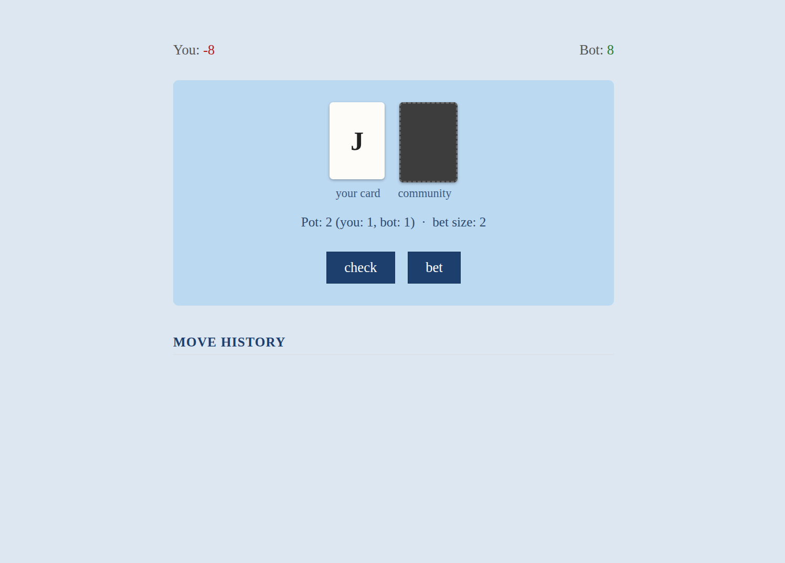
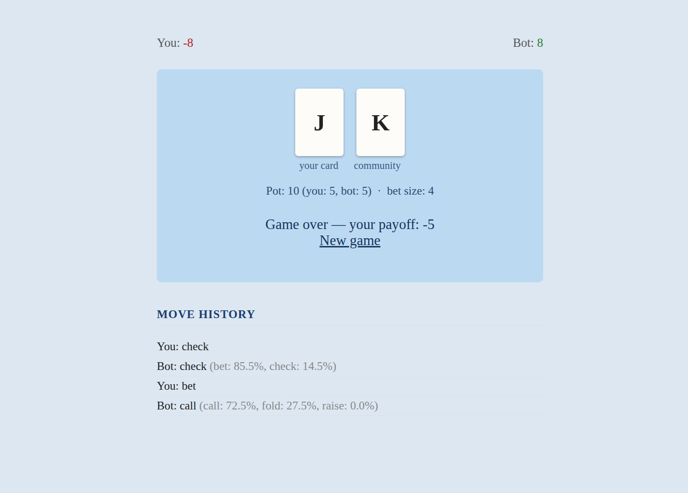

# Leduc Hold'em CFR Bot

A poker bot for Leduc Hold'em (a small poker game used in game theory research),
trained from scratch with Counterfactual Regret Minimization (CFR). Includes a small
Django web app to play against it.



<br clear="left" />

## Why Leduc Hold'em

It's a simplified poker game (6 cards, 2 betting rounds, one community card) — small
enough to actually solve, but still has hidden information and betting, so it's a
common benchmark for this kind of algorithm.

The game rules are obviously implemented by hand, but the bot's strategy — what to
actually do in a given situation — isn't. It's learned purely by playing against
itself many times and minimizing regret, which converges towards a Nash equilibrium:
a strategy that can't be reliably exploited.

## How it's built

- **`games/`** — the game engines. Kuhn Poker (a tiny 3-card poker game with a known
  equilibrium) is there too, used to check the CFR implementation before
  trying it on Leduc.
- **`cfr/`** — the CFR trainer. Tracks regret per information set and uses regret
  matching to pick a strategy proportional to it. The strategy actually used is the
  *average* over all training iterations, not the last one.
- **`train_leduc.py` / `build_leduc_strategy.py`** — runs training and saves the
  result to `leduc_strategy.pkl`, so the web app doesn't retrain on every startup.
- **`pokerbot/`** — the Django app. Tracks game state per session, and samples the
  bot's move from its trained probabilities (not just the most likely one).

## How I checked it works

- `tests/test_leduc.py`, `tests/test_kuhn.py` — plain rule tests (raise limits, round
  transitions, payoffs), no CFR involved.
- `tests/test_cfr_leduc.py`, `tests/test_cfr_khun.py` — sanity checks on the trained
  strategy (e.g. bets a lot with a made pair, folds a lot with a hopeless hand).
- For Kuhn Poker I could compare against a published equilibrium (King should bet
  ~3x as often as Jack) — that's what first convinced me the CFR was correct.

## Running it locally

```bash
python3 -m venv venv
source venv/bin/activate
pip install -r requirements.txt

python3 build_leduc_strategy.py   # trains the bot, takes a few minutes
python3 manage.py migrate
python3 manage.py runserver
```

Then open `http://127.0.0.1:8000/start/`.

## Running the tests

```bash
pytest
```

## Project structure

```
games/          game engines (Kuhn Poker, Leduc Hold'em)
cfr/            CFR trainer
pokerbot/       Django app
webapp/         Django project config
tests/          engine tests + trained-strategy sanity checks
```
